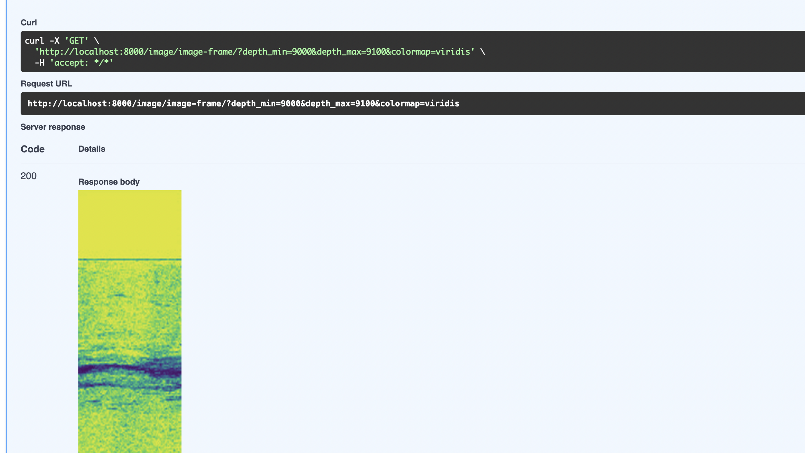

# image_frames_server
FastApi practice challenge

## Installation
To set up the project, you need to have **Python 3.12** and **Docker** installed on your machine

Run `make install`

## How to run
To run the application in a Docker container: `make run-docker`  

To test api open: `http://localhost:8000/docs`

Use `image/image-frame` api endpoint (depth parameter in [9000.1, 9546.0])

## Tests
`make test`

## Auto lint
`make lint-auto`